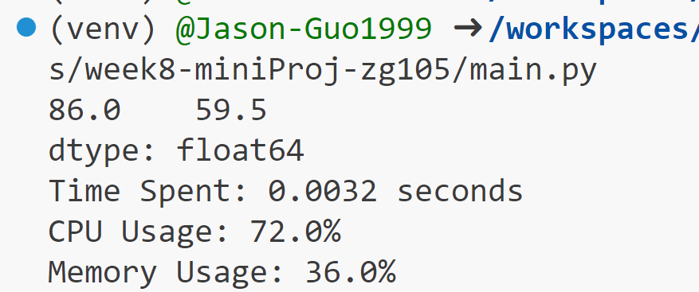
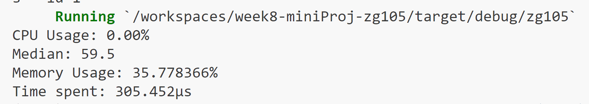

# Week8-miniProj-zg105

This is a simple comparation between python script and Rust script:

- read a csv
- calculate median number
- report the resources usage

## Prerequisites

- ruff==0.0.284
- pandas

## Functions

1. **main.py**: the python script to read data.csv, calculate median and report resources usage.

2. **src/main.rs**: the rust script to read data.csv, calculate median and report resources usage.

3. **Cargo.toml**: Run with "cargo run" to start a new project with dependencies.

## Demo
run "python3 main.py" to start

run "cargo run" to build a rust project and download dependencies.

cd src and run "cargo run" to see

